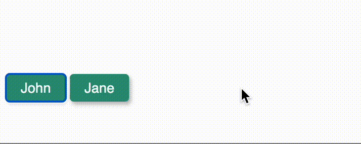

# Introduction

## Welcome to BotUI documentation 👋🏼

BotUI makes it super easy to create conversational (bot) interfaces. It has an intuitive JavaScript API to add messages and show actions that a user can perform. It has a React package but Vue and other frameworks are also supported (you can easily intergrate it into your [insert-any-framework-name-here] project).

Learn how to:

- [Install BotUI](./install.md)
- [Read `botui` Docs](./core/readme.md)
- [Read `@botui/react` Docs](./react/readme.md)