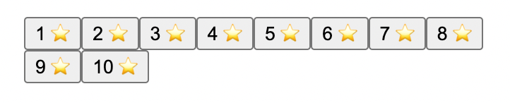
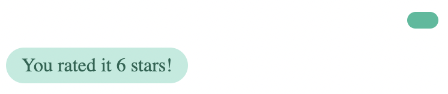

# Adding custom actions and messages

BotUI is easily extensible with custom actions and messages. Following guide goes over adding a star-rating action and its companion message.

## Add a custom action

Creating a star rating action.

```jsx
const StarsAction = () => {
  const bot = useBotUI() // current instance
  const action = useBotUIAction() // get current action
  const array = new Array(action.data.total).fill('⭐️') // to make it easier to iterate

  return <div>
  {
    array.map((v, i) => <button key={i} onClick={() => {
      bot.next({ starsGiven: i + 1 }) // to resolve the action
    }}>{ i + 1 } { v }</button>)
  }
  </div>
}
```

```js
const actionRenderers = {
  'stars': StarsAction
}
```

```jsx
<BotUIAction renderer={actionRenderers} />
```

```js
botui.action.set(
  { total: 10 }, // data
  { actionType: 'stars' } // meta
)
.then(data => { // data is what was returned from .next()
  return botui.message.add({ text: `You rated it ${data.starsGiven} stars!`  })
})
```

Running the above will render something like this:



And clicking one of the buttons will show the response we added.



Notice the human-side message is empty. Let's fix that by adding a custom `messageType` that can handle the response of our action.

## Add a custom message

Similar to adding a custom action, you can also add a custom message.

Let's create a message to render stars.

```jsx
const StarsMessage = ({ message }) => {
  const stars = new Array(message.data.starsGiven).fill('⭐️') // to make it easier to iterate

  return <div>
  { stars }
  </div>
}
```

```js
const messageRenderers = {
  'stars': StarsMessage
}
```

```jsx
<BotUIMessageList renderer={messageRenderers} />
```

Now let's go back to our `stars` action example and just update the `.next()` to use our new `messageType`:

```js
bot.next({ starsGiven: i + 1 }, { messageType: 'stars' }) // to resolve the action
```

Now when we click one of the buttons from our action we'll see a nice star-showing message:


Let's cleanup now:

```jsx
const StarsAction = () => {
  const bot = useBotUI() // current instance
  const action = useBotUIAction() // get current action
  const array = new Array(action.data.total).fill('⭐️') // to make it easier to iterate

  return <div>
  {
    array.map((v, i) => <button key={i} onClick={() => {
      bot.next({ starsGiven: i + 1 }, { messageType: 'stars' }) // to resolve the action
    }}>{ i + 1 } { v }</button>)
  }
  </div>
}
const StarsMessage = ({ message }) => {
  const stars = new Array(message.data.starsGiven).fill('⭐️') // to make it easier to iterate

  return <div>
  { stars }
  </div>
}
```

```js
const messageRenderers = {
  'stars': StarsMessage
}
const actionRenderers = {
  'stars': StarsAction
}
const renderers = {
  actionRenderers: actionRenderers,
  messageRenderers: messageRenderers,
}
```

```js
const myBot = createBot()
```

```jsx
<BotUI bot={myBot}>
  <BotUIMessageList renderer={renderers.messageRenderers} />
  <BotUIAction renderer={renderers.actionRenderers} />
</BotUI>
```

```js
myBot.action.set(
  { total: 10 }, // data
  { actionType: 'stars' } // meta
)
.then((data) => { // data is what was returned from .next()
  return myBot.message.add({ text: `You rated it ${data.starsGiven} stars!`  })
})
```